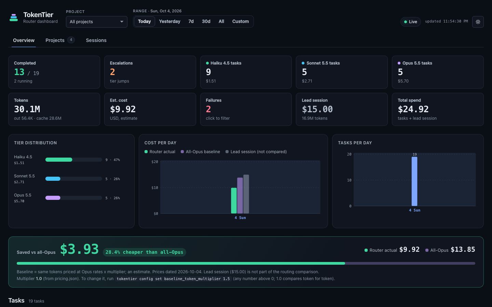
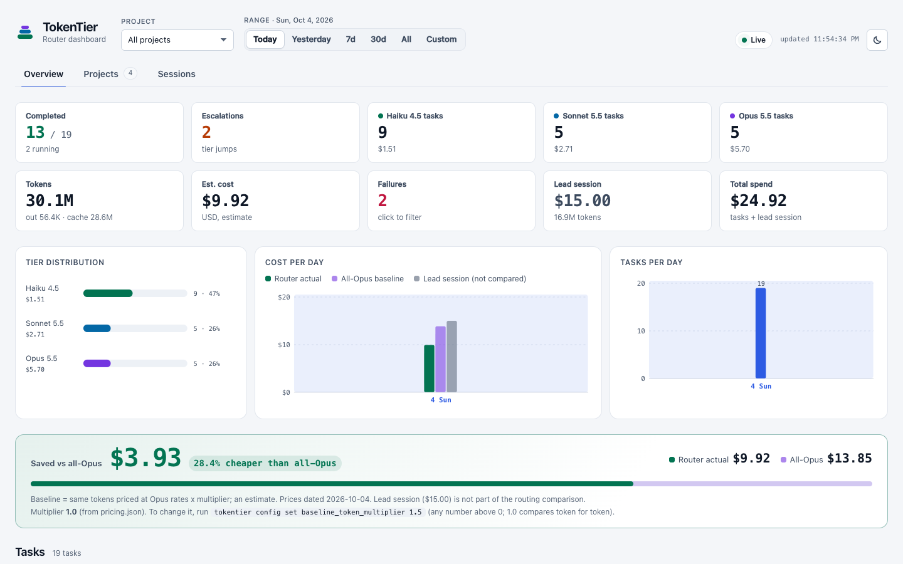
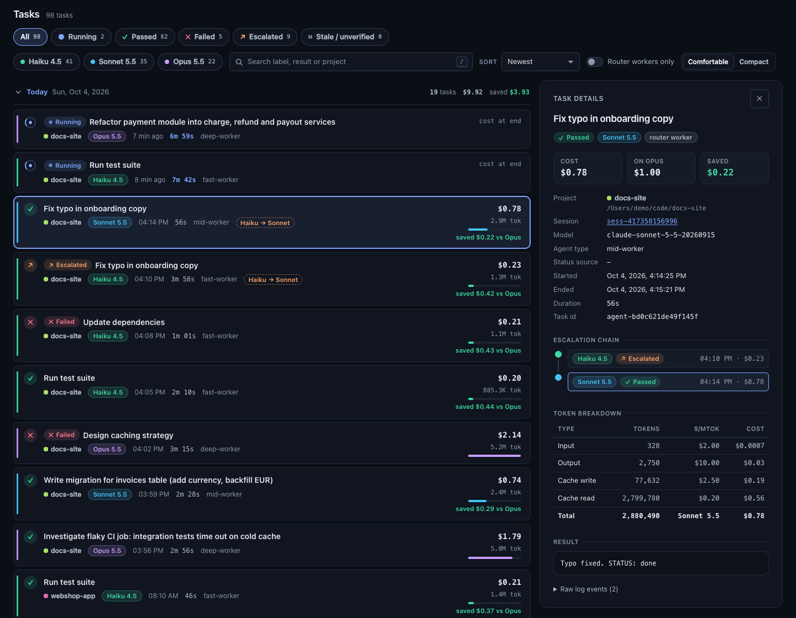
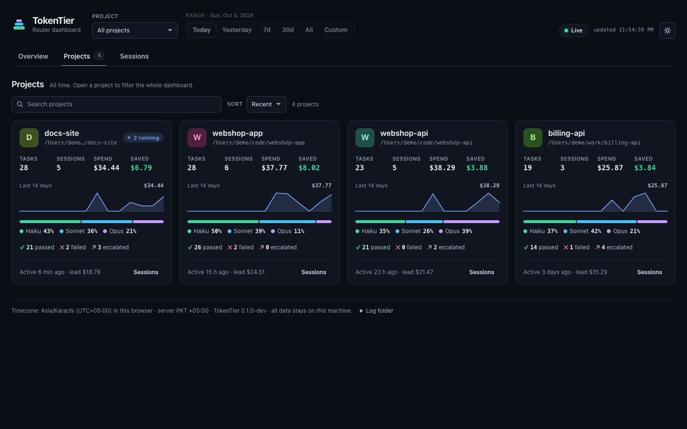
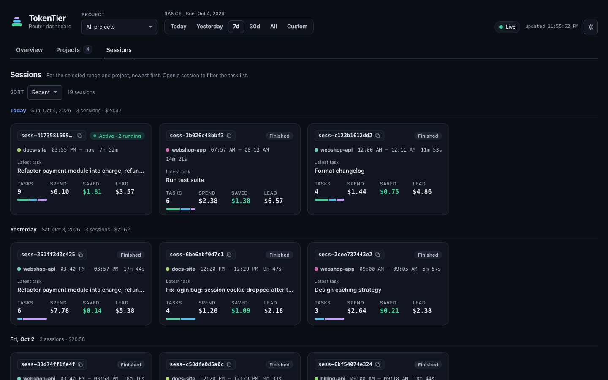
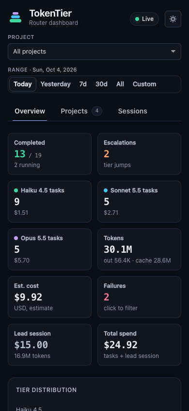

# TokenTier

Cost-aware model routing for Claude Code.

TokenTier sends your Claude Code tasks to the cheapest model tier that can handle them. It starts with Haiku and moves up to Sonnet and then Opus only when a check fails. Every task is logged on your machine, and a local dashboard shows what each one cost and how much you saved compared with running everything on Opus.

**Status:** v0.1.0-dev. Supports macOS and Linux. Windows 10/11 support is implemented but **experimental**: it is verified by simulation and CI only, not yet on a real Windows machine (see [Windows](#windows)).

## Screenshots

All screenshots use generated demo data (`tests/make_sample_logs.py`), not real logs.



Light theme (switch with the sun/moon button in the header; the choice is remembered in the browser):











## What gets installed

| Piece | Where (global install) | Purpose |
|---|---|---|
| 3 worker agents | `~/.claude/agents/{fast,mid,deep}-worker.md` | Haiku / Sonnet / Opus subagents |
| `tokentier-router` skill | `~/.claude/skills/tokentier-router/SKILL.md` | The cascade rules: start cheap, verify, escalate |
| Router line | `~/.claude/CLAUDE.md`, between `<!-- tokentier:start -->` and `<!-- tokentier:end -->` | Tells Claude to use the skill |
| Logging hooks | `~/.claude/settings.json` → `hooks.SessionStart/SessionEnd/SubagentStart/SubagentStop/Stop` | Append events to `~/.tokentier/logs/YYYY-MM-DD.jsonl`. The `Stop` hook also logs the main session's own token usage (counts only) |
| App copy | `~/.tokentier/app/` | Hook script, dashboard, CLI. After install you can move or delete the repo |
| Dashboard service | macOS: `~/Library/LaunchAgents/dev.tokentier.dashboard.plist`; Linux: `~/.config/systemd/user/tokentier-dashboard.service`; Windows: Task Scheduler task "TokenTier Dashboard" | Always-on dashboard at http://127.0.0.1:8899/ |
| Manifest | `~/.tokentier/install-manifest.json` | Records every change, so uninstall can undo exactly those changes |

The installer **merges** into your existing `settings.json`. It never reorders, drops or rewrites your own keys or hooks, and it backs up every file it changes to `~/.tokentier/backups/<timestamp>/` first. If `settings.json` is not valid JSON, the installer stops and changes nothing.

## Install

Requirements: Python 3.9+ and Claude Code (desktop app or CLI). macOS and Linux are supported; Windows is experimental. Nothing else is needed.

### Quick start

1. Clone the repo: `git clone <repo-url> tokentier && cd tokentier`
2. Preview, then install. The dry run lists every file and shows diffs for `settings.json` and `CLAUDE.md`, and writes nothing. The real run shows the plan and asks once before writing.

   ```bash
   ./install.sh --dry-run
   ./install.sh
   ```

3. Restart Claude Code and run `/agents`. You should see `fast-worker`, `mid-worker` and `deep-worker`.
4. Check that it works. Run any task that uses a worker, for example: `Use the fast-worker agent to list the files in this folder`. Then open http://127.0.0.1:8899/ and look for the task under Today.

For a health check at any time, run `tokentier doctor` (see the alias below). The `claude` command does not need to be on your PATH if you use the desktop app. `doctor` warns about it, and the warning is harmless.

The CLI is installed at `~/.tokentier/app/bin/tokentier`. Add an alias for convenience:

```bash
alias tokentier=~/.tokentier/app/bin/tokentier
```

### Options

| Flag | Meaning |
|---|---|
| `--dry-run` | Show what would change, write nothing |
| `--yes` | Do not ask for confirmation (for scripts) |
| `--project [DIR]` | Install into one project (`DIR/.claude/…` and `DIR/CLAUDE.md`). DIR defaults to the current directory. You can run this in as many projects as you like. All projects log to the same `~/.tokentier/logs/` |
| `--no-service` | Skip the always-on dashboard. Start it when you need it with `tokentier dashboard` |
| `--no-hooks` | Skip the logging hooks (agents, skill and CLAUDE.md only) |
| `--port N` | Dashboard port (default 8899). Also saved as `port` in `~/.tokentier/config.json` (see [Configuration](#configuration)) |
| `--claude-dir DIR` | A different Claude Code config dir (default `~/.claude`, or `$CLAUDE_CONFIG_DIR`) |
| `--home DIR` | A different TokenTier home (default `~/.tokentier`, or `$TOKENTIER_HOME`) |

Running the installer again is safe. If nothing changed it says "Nothing to do". To upgrade, `git pull` and run `./install.sh` again. If you edited `~/.tokentier/app/dashboard/pricing.json`, the upgrade keeps your copy and writes the new defaults next to it as `pricing.json.new`.

### Global or per project?

| | Global (default) | Per project |
|---|---|---|
| Command | `./install.sh` | `./install.sh --project [DIR]` |
| Agents, skill, router line | at user level | inside that project |
| Logging hooks | at user level | added only if the global hooks are not installed |
| Works in | every project you open | only that project |
| Log and dashboard | one shared log, one dashboard | the same shared log and dashboard |

A global install works in every project you open in Claude Code, with no per-project step. A per-project install additionally puts the agents, skill and `CLAUDE.md` router line inside that project, which is useful for sharing the routing setup with teammates through the repo. You can repeat it for as many projects as you like. If the global hooks are installed, logging in that project already comes from them. With only project installs and no global install, only those projects are logged.

Recommended: install globally, and add per-project installs only when you want the setup committed in a repo.

```bash
./install.sh                          # global
./install.sh --project ~/code/myapp   # one project (repeat for others)
tokentier uninstall --project ~/code/myapp   # remove that project's install
```

**Project installs and double logging.** Claude Code runs user-level and project-level hooks together. If the global hooks are already installed, `--project` installs the agents, skill and CLAUDE.md line in the project but does **not** add hooks there, because every event would then be logged twice. Logging in that project already works through the global hooks. If you installed a project first and later installed globally, `tokentier doctor` warns about the duplicates and prints the fix: `tokentier uninstall --project <dir> --hooks-only`.

Note: a project install writes absolute paths (to `~/.tokentier/app/...`) into `DIR/.claude/settings.json`. If you commit that file, teammates get your paths. Prefer the global install for personal use.

**Port already in use.** If something else already listens on port 8899, the service is still installed. The installer warns you and prints the fix: stop the other program, or re-run with `--port 8900`. TokenTier never kills other processes.

## Windows

> **Experimental until verified on real Windows.** Windows 10/11 support is implemented and covered by unit tests that simulate Windows, plus a Windows CI job, but nobody has run it on a real Windows machine yet. Please try it and [report issues](CONTRIBUTING.md#windows-smoke-test), including the output of `tests\windows_smoke.ps1`.

**Requirements:** Windows 10 or 11, Python 3.9 or newer from [python.org](https://www.python.org/downloads/windows/) (the `py` launcher or `python.exe` on PATH; the Microsoft Store stub that only opens the Store is detected and skipped), Claude Code 2.1.139 or newer (for exec-form hooks). No admin rights are needed.

**Install** from the repo folder, in PowerShell or cmd:

```powershell
.\install.ps1 --dry-run     # preview, writes nothing
.\install.ps1               # install (asks once)
```

If PowerShell refuses to run scripts (execution policy), use the `.cmd` wrappers, which take the same arguments: `install.cmd --dry-run`, `install.cmd`. The launchers look for Python as `py -3`, then `python`, then `python3`, and download nothing. All other options (`--project`, `--no-service`, `--port`, ...) work as on macOS/Linux.

**Where files live:** `%USERPROFILE%\.claude\` (agents, skill, `CLAUDE.md`, `settings.json`) and `%USERPROFILE%\.tokentier\` (logs, app copy, manifest, backups; `TOKENTIER_HOME` overrides it). `settings.json` and `CLAUDE.md` keep their line endings (CRLF or LF) and UTF-8 BOM byte for byte, and uninstall restores them exactly.

**How hooks run:** each hook is registered in Claude Code's *exec form*: the absolute path of the `python.exe` that ran the installer as `command`, and the hook script plus the event name as `args`, for example:

```json
{"type": "command", "command": "C:/Users/you/AppData/Local/Programs/Python/Python312/python.exe",
 "args": ["C:/Users/you/.tokentier/app/hooks/tokentier_log.py", "SubagentStop"], "timeout": 10}
```

Claude Code starts that program directly, without Git Bash or PowerShell, so spaces in your user name or paths need no quoting. If you uninstall or move that Python, re-run the installer (`tokentier doctor` reports a missing interpreter). A custom `TOKENTIER_HOME` is passed as `--home DIR` in `args`. Log files are always written with LF line endings, so logs are identical on every OS.

**Always-on dashboard:** the installer registers a per-user Task Scheduler task named "TokenTier Dashboard" (`schtasks /Create /XML`; the task file is `%USERPROFILE%\.tokentier\tokentier-dashboard-task.xml`). It starts `pythonw.exe` (no console window) at logon, restarts it every minute if it crashes, and has no battery or time limits. Output goes to `%USERPROFILE%\.tokentier\dashboard.log`. If Task Scheduler refuses (some company policies block it), the installer falls back to a `TokenTier Dashboard` value under `HKCU\Software\Microsoft\Windows\CurrentVersion\Run`, starts the dashboard right away and says so. `tokentier status` and `tokentier doctor` show `service: scheduled task, running: yes/no`. `--no-service` skips all of this.

**Remove it:** `.\uninstall.ps1` (or `uninstall.cmd`) ends and deletes the scheduled task (`schtasks /End` and `/Delete`), removes the Run value if the fallback was used, and restores your files as on macOS/Linux. A dashboard started from the Run fallback keeps running until you log off (or end `pythonw.exe` in Task Manager).

**PATH tip:** the CLI is `%USERPROFILE%\.tokentier\app\bin\tokentier.cmd`. To type just `tokentier`, add `%USERPROFILE%\.tokentier\app\bin` to your user PATH (Start, "Edit environment variables for your account", Path, New). The installer prints this hint but never changes PATH itself.

**Known limits:**

- Not yet verified on a real Windows machine (see the note at the top of this section).
- Needs Claude Code 2.1.139 or newer: older versions do not understand exec-form hooks (`args`).
- Paths longer than 260 characters (deep user profiles plus `backups\<timestamp>\...`) may fail unless Windows long-path support is enabled.
- The time zone shown in the dashboard is Windows' own name (for example "Pakistan Standard Time"); day boundaries use your local UTC offset as on other systems.
- Claude Code itself decides whether a console window flashes when it starts a hook; TokenTier's own background helper and the dashboard use `pythonw.exe` / detached processes so they never open one.

## Use

```bash
tokentier status      # version, scopes, hooks, service, dashboard URL + HTTP check, log counts, latest event
tokentier doctor      # PASS/WARN/FAIL checks with a fix hint for each problem; exit code 1 if anything FAILs
tokentier open        # open the dashboard in your browser
tokentier stats       # per task-type routing stats and recommended start tiers (see "Routing hints")
tokentier dashboard   # run the dashboard in the foreground (if you used --no-service). Use --port N to pick a port
tokentier config list # show settings and where each value comes from (see "Configuration")
tokentier prune       # delete old daily logs (see "Log retention")
```

Dashboard: **http://127.0.0.1:8899/**. It listens on 127.0.0.1 only, so other machines cannot reach it.

Logs: `~/.tokentier/logs/YYYY-MM-DD.jsonl`, one append-only file per local day, one JSON event per line. Hook errors go to `~/.tokentier/hook-errors.log`; ignored internal helper subagents are noted in `~/.tokentier/hook-ignored.log`. Service output goes to `~/.tokentier/dashboard.log`.

### Importing old router-kit data

This is only for people who used the earlier hand-written router-kit dashboard (`router-kit-data.json`). Everyone else can skip it. To see what an import would do, without writing anything:

```bash
tokentier migrate legacy --file router-kit-data.json --dry-run
```

Details, including fixing dates, are in [docs/migrating-from-router-kit.md](docs/migrating-from-router-kit.md).

## How routing works

You (the main Claude Code session) are the router. For a non-trivial task the `tokentier-router` skill does this:

1. **Classify and pick a start tier.** Simple edits, lookups and summaries start at `fast-worker` (Haiku). Multi-file changes, bug fixes with a known cause and tests start at `mid-worker` (Sonnet). Architecture, hard bugs and security work start at `deep-worker` (Opus).
2. **Run the worker** as a subagent. The Agent `description` starts with a type tag such as `[bugfix]`, `[feature]`, `[docs]`, `[refactor]`, `[test]` or `[research]`.
3. **Verify with something concrete** (tests, build, linter, or a checklist). A worker that says `STATUS: escalate` or `STATUS: blocked` fails the check.
4. **Escalate on failure**, one attempt per tier: Haiku, then Sonnet, then Opus. A worker that cannot finish replies `ESCALATE:` plus a one-line reason, and the router passes that reason on to the next tier.

The logging hooks record every subagent start and stop (tier, tokens, status, escalation reason) in `~/.tokentier/logs/`, and the main session's own token usage after each turn. The dashboard and `tokentier stats` read those logs.

## Routing hints (`tokentier stats`)

```bash
tokentier stats                       # table for the last 30 days
tokentier stats --days 7              # a different window
tokentier stats --json                # machine-readable
tokentier stats --write-hints         # also write ~/.tokentier/routing-hints.json
```

Task type is the leading `[tag]` of the task label (for example `[bugfix] Fix login`), otherwise `untagged`. For each type, the table shows attempts and pass rate per tier, the escalation rate (share of tasks that needed a higher tier), the average cost per task, and a **start tier**: the cheapest tier with at least 5 attempts and a pass rate of 80% or more. If no tier qualifies, it is the tier above the highest one that was tried and fell short. Types with fewer than 5 attempts show `insufficient data`.

`--write-hints` saves the recommendations (untagged excluded) to `routing-hints.json` in the TokenTier home, atomically:

```json
{"generated": "2026-10-04T12:00:00+05:00", "types": {"bugfix": {"start": "mid-worker", "samples": 12, "pass_rate": 0.83}}}
```

The skill reads this file once per session and uses it only to start **higher** than its default table, never lower. Going cheaper than the table needs your say-so. Run the command again whenever you want fresh hints. It never runs automatically.

## Pricing and the savings estimate

Prices live in `dashboard/pricing.json` (`~/.tokentier/app/dashboard/pricing.json` after install), in dollars per million tokens, per model: `input`, `output`, `cache_write` and `cache_read`. **Cache tokens are priced separately** from normal input, because cache reads are far cheaper than fresh input and cache writes cost a little more. The file is editable, and the dashboard picks up changes without a restart. To keep your own table separate from the shipped one, point `pricing_path` at it (see [Configuration](#configuration)).

The **savings figure is an estimate**: it prices the same tokens at the `baseline_tier` (Opus by default) and subtracts what the work actually cost. `baseline_token_multiplier` (default `1.0`) scales the baseline if you believe an all-Opus run would have used more or fewer tokens than the routed run. Raise it for a more optimistic estimate, keep `1.0` to compare token for token. Change it without editing any file: `tokentier config set baseline_token_multiplier 1.5` (this overrides the value in `pricing.json`; `tokentier config unset baseline_token_multiplier` goes back to it). The dashboard banner shows the effective multiplier (formatted `1.0`, `1.5`), where it comes from, and an `adjusted` badge when it is not 1. `/api/pricing` and `/api/health` report it as `baseline_token_multiplier` with `baseline_source` (`pricing.json`, `config.json`, `default`, or `env` when an environment variable sets it). The API is read-only: there is no way to change settings over HTTP. Tasks whose model is not in the pricing table show no cost, and imported legacy tasks (which only have a token total) are not priced.

## Configuration

Settings live in `~/.tokentier/config.json` (or `$TOKENTIER_HOME/config.json`). The file is optional and every key is optional:

```json
{"port": 8899, "retention_days": null, "pricing_path": null, "baseline_token_multiplier": null}
```

| Key | Env var | Default | Meaning |
|---|---|---|---|
| `port` | `TOKENTIER_PORT` | `8899` | Dashboard port, 1-65535 |
| `retention_days` | `TOKENTIER_RETENTION_DAYS` | `null` (keep forever) | Delete daily logs older than N days (integer >= 1). See [Log retention](#log-retention) |
| `pricing_path` | `TOKENTIER_PRICING_PATH` | `null` (shipped file) | Your own `pricing.json`, same schema as the shipped one. It overrides the shipped file and is reloaded when it changes. If it is invalid, the previous table stays in use and the problem is listed under `warnings` in `/api/health` |
| `baseline_token_multiplier` | `TOKENTIER_BASELINE_TOKEN_MULTIPLIER` | `null` (use `pricing.json`, which ships `1.0`) | Number > 0. Overrides the multiplier in `pricing.json`. See [Pricing and the savings estimate](#pricing-and-the-savings-estimate) |

**Precedence**, for each key: command-line flag > environment variable > `config.json` > built-in default. Flags exist for `port` (`tokentier dashboard --port N`, `tokentier install --port N`) and `retention_days` (`tokentier prune --older-than DAYS`). An invalid environment or file value is ignored with a warning and the next source is used.

The dashboard **always listens on 127.0.0.1**. That is not configurable: a `host` key is ignored with a warning (and `tokentier doctor` flags it).

Manage the file with the CLI. It validates every value, writes atomically, keeps keys it does not know and keeps your formatting:

```bash
tokentier config list                                   # every key, its effective value, and where it comes from
tokentier config get port
tokentier config set port 8900
tokentier config set retention_days 90
tokentier config set baseline_token_multiplier 1.5
tokentier config set pricing_path ~/my-pricing.json     # must exist and be a valid pricing file
tokentier config set retention_days null                # clear a value (same idea as unset)
tokentier config unset retention_days
tokentier config path                                   # print the file location
```

`config list [--json]`, `config get KEY`, `config set KEY VALUE`, `config unset KEY` and `config path` all accept `--home DIR`. Exit codes: `0` ok, `1` error (for example `config.json` is not valid JSON; it is never overwritten), `2` invalid key or value. `set` accepts `null` to clear a key. Ranges: `port` 1-65535, `retention_days` null or an integer >= 1, `baseline_token_multiplier` null or a finite number > 0, `pricing_path` null or an existing, parseable pricing file.

The dashboard re-reads `config.json` while it runs, so `baseline_token_multiplier` and `pricing_path` apply without a restart. `port` is read at startup, and the always-on service has its port written into the service file, so after `tokentier config set port N` run `tokentier install` once to apply it.

`tokentier install --port N` writes `port` into `config.json` (and still passes `--port N` to the service). The manifest records whether the installer created the file. `tokentier uninstall` removes `config.json` only if the installer created it and it has not changed since; otherwise it is kept and uninstall says so. `tokentier doctor` has a `config` check: it fails on invalid JSON or invalid values and warns about unknown keys.

## Log retention

By default logs are kept forever (they are small). Set a retention period to delete old daily files:

```bash
tokentier config set retention_days 90
tokentier prune --dry-run          # list what would be deleted, with sizes; delete nothing
tokentier prune                    # same list, then asks for confirmation
tokentier prune --yes              # no question (scripts)
tokentier prune --older-than 30    # one-off period, overrides retention_days
```

`prune` looks only at files named `logs/YYYY-MM-DD.jsonl` and uses the **date in the file name** (your local date): a file is deleted when that date is older than the period (with `--older-than 7` on the 20th, the 13th is kept and the 12th goes). **Today's and yesterday's files are never deleted**, and files with any other name are never touched. Without `--older-than` it uses `retention_days`; if neither is set it prints `retention not configured; nothing to do` and exits 0.

When `retention_days` is set, the dashboard server also prunes once at startup and then every 24 hours, and prints each file it removed to its output (`~/.tokentier/dashboard.log` for the service). Usage totals in the dashboard then cover only the logs that are left.

## Troubleshooting

Start with `tokentier doctor`. It prints PASS/WARN/FAIL for each check with a fix hint, and `tokentier status` shows the install state, service and latest logged event.

- **Port busy (8899).** Another program is listening. TokenTier never kills it. Stop that program, or install with `--port 8900`, or run `tokentier dashboard --port 8900`.
- **Hooks not firing / nothing is logged.** Restart Claude Code after installing, because hooks and agents load at start. Then run `tokentier doctor` and check `~/.tokentier/hook-errors.log`.
- **Every event is logged twice.** Both global and project hooks are installed. Remove the project ones: `tokentier uninstall --project <dir> --hooks-only`. `tokentier doctor` detects this.
- **No tasks in the dashboard.** Delegated subagent runs show up as tasks. Run a routed task in Claude Code, then reload. The main session's own usage is logged separately (see below) and never appears as a task row.
- **A task shows "? unverified" or "inferred".** Workers end their final report with `STATUS: done`, `STATUS: escalate` or `STATUS: blocked`. If a worker forgets, TokenTier infers the status: a non-empty report that mentions no problem (escalate, blocked, unable to, could not, cannot, failed, error: ...) counts as `pass` and is shown with a small "inferred" marker. A report that mentions a problem, or is empty, shows as "? unverified", which means please check it yourself. Claude Code reports each subagent finishing twice, so TokenTier merges the events per task and never lets a weaker one overwrite a stronger one.
- **Killed workers.** When you stop a subagent, Claude Code never sends `SubagentStop`, so TokenTier cannot log its tokens. The hook records the path of the worker's transcript at start; the dashboard only checks that file's modification time (it never reads it). A worker whose transcript has not changed for 15 minutes is shown as **stale** ("no activity for N min", with its last activity time) and is not counted as running; if it resumes it goes back to running, and a normal finish always wins. Tasks logged before this feature, or without a transcript path, are marked stale after 2 hours.
- **A running task has no label for a few seconds.** Labels are filled in shortly after a task starts by a short-lived background helper (a `task_update` event in the log).

### Lead session usage

The main ("lead") session's own token usage is logged by a `Stop` hook after each turn and shown as the **Lead session** and **Total spend** tiles. It is not part of the routing savings comparison, because which model your main session uses is your own choice. A session that was already running when TokenTier was installed is logged from the moment the hook first fires, not from its beginning.

## Uninstall

```bash
./uninstall.sh --dry-run   # preview
./uninstall.sh             # or: tokentier uninstall
```

Uninstall works strictly from the manifest. It removes only what TokenTier added:

- It stops and removes the dashboard service.
- It removes only TokenTier's hook entries from `settings.json`. If you have not edited the file since, it is restored to its exact original bytes.
- It removes the marker block from `CLAUDE.md`. If the router line was already in your `CLAUDE.md` before the install, it is left alone.
- It removes the agents and skill it created, and restores your previous versions from the backups.
- It removes `~/.tokentier/app`.
- It also removes TokenTier's internal files in `~/.tokentier` (`state/`, the helper logs and `routing-hints.json`) and keeps `logs/`. `--purge` removes the whole `~/.tokentier` folder, including the logs.
- It removes `~/.tokentier/config.json` only if the installer created it (`install --port`) and you have not changed it since. Otherwise it is kept and uninstall says so.

Files you edited after the install, including a TokenTier hook entry you changed, are left in place and listed. Your logs stay in `~/.tokentier/logs` unless you pass `--purge`, which asks for confirmation first.

Other options: `--project DIR` (remove only that project's install), `--hooks-only` (remove only the hook entries; combine with `--project DIR` for a project), `--keep-service`, `--yes`.

## Privacy

Everything stays on your machine. The hooks write to local files under `~/.tokentier/`, and the dashboard reads them and serves them on 127.0.0.1. Nothing is sent anywhere, and there is no telemetry. The logs contain project names and paths, task labels (the subagent description) and a short excerpt of each result. Delete them at any time with `rm -rf ~/.tokentier/logs` or `tokentier uninstall --purge`.

- The `Stop` and `SessionEnd` hooks read the main session transcript only to sum token usage per model. They store counts only, not prompts or replies.
- The dashboard only checks the modification time of subagent transcript files, to detect stale workers. It never reads their contents.
- The dashboard has no write endpoints: it answers read requests only, and POST, PUT, DELETE and PATCH are refused.
- The hooks never make network requests.

## License

TokenTier is licensed under the Apache License 2.0 (see LICENSE and NOTICE), Copyright 2026 Qasim Raheem Khokhar. TokenTier is not affiliated with or endorsed by Anthropic. 'Claude' is a trademark of Anthropic.

## Roadmap

- Windows: implemented (experimental). Next: verify on real Windows 10/11 machines and remove the "experimental" label.
- A team/cloud edition is planned. The local kit stays free, open source and fully offline.

## Releases

Tagged releases (`v*`) are built by GitHub Actions from `git archive`, so only tracked files ship. Each release has `tokentier-<version>.tar.gz`, `tokentier-<version>.zip` and `SHA256SUMS`.

```bash
sha256sum -c SHA256SUMS --ignore-missing        # Linux
shasum -a 256 -c SHA256SUMS --ignore-missing    # macOS
```

To cut a release: set `VERSION` to the bare version (for example `0.1.0`), turn `## [Unreleased]` in CHANGELOG.md into `## [0.1.0] - YYYY-MM-DD`, commit, then `git tag v0.1.0 && git push origin v0.1.0`. The workflow fails if the tag and `VERSION` disagree.

## Development

```bash
python3 -m unittest discover -s tests
```

See `CONTRIBUTING.md` for the full guide and `SECURITY.md` for reporting vulnerabilities. Optional extras (such as a low-effort Opus worker) are in `kit/extras/`; the installer does not install them.

The tests never touch your real `~/.claude`, `~/.tokentier` or `~/Library/LaunchAgents`. They run the CLI with a temporary `HOME` and set `TOKENTIER_NO_SERVICE_EXEC=1`, which writes service files but never runs `launchctl` or `systemctl`. For manual experiments, do the same:

```bash
export HOME=$(mktemp -d) TOKENTIER_NO_SERVICE_EXEC=1
./install.sh --yes --no-service && ~/.tokentier/app/bin/tokentier doctor
```

---

*TokenTier is an independent project and is not affiliated with or endorsed by Anthropic. Claude and Claude Code are trademarks of Anthropic.*
